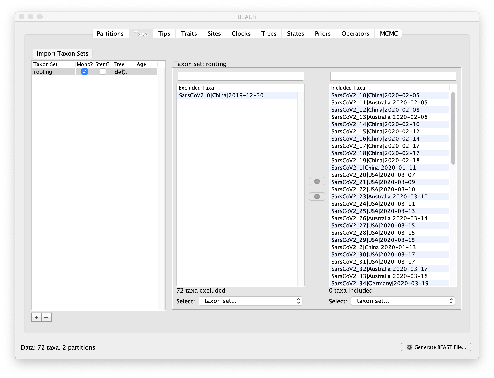

# COVEME 2021: Travel-aware phylogeography with BEAST example - SARS-CoV-2 phylogeography

## Discrete state phylogeography (without travel history)

## Use the provided file `aln.fasta` to create a discrete state phylogeography XML with BEAUti with the following specifications:

   * Load the alignment by dragging the file to the `Partitions` tab

   * Root the phylogeny on the oldest sequence `SarsCoV2_0|China|2019-12-30`. To do this create a taxon set and include all taxa except for `SarsCoV2_0|China|2019-12-30`. Force monophyly by checking the `Mono?` box

    * Specify the date of the tips using `Parse Dates` on the `Tip` tab and using "|" as the delimited

    * Add a location trait using `Add Trait` on the `Traits` tab. Make sure `Create corresponding data partition` is checked. Specify the trait using `Guess trait values`

    * Use the default HKY substitution model and specify an asymmetric discrete state substitution model with BSSVS on the `Sites` tab

    * Leave the default clock models on the `Clocks` tab
    * Specify a `Coalescent: Exponential Growth` prior on the `Trees` tab

    * Track Markov jumps by checking `Reconstruct state change counts` and `Reconstruct complete change history on tree` on the `States` tab

    * Use default priors except for a Lognormal(1,2) prior on `exponential.popSize`

    * Leave the default operators on the `Operators` tab
    * Log every 5000 states with a 10M chain length on the MCMC tab


## Provide a good starting tree to reduce burnin

To do so, open the XML file in your text editor of choice and replace the randomly generated starting tree with the newick tree file provided.

Search for:
```
	<coalescentSimulator id="startingTree">
		<coalescentSimulator>
			<taxa idref="rooting"/>
			<exponentialGrowth idref="exponential"/>
		</coalescentSimulator>
		<taxa idref="taxa"/>
		<exponentialGrowth idref="exponential"/>
	</coalescentSimulator>

```

and replace with:
```
	<newick id="startingTree">

<!-- PASTE CONTENTS OF starting_tree.newick HERE -->

	</newick>

```

## Modify the XML by adding the travel history specification

To do this, use the `add_travel_history.py` python script along with the travel history metadata file to create a new XML file.

```bash
python add_travel_history.py --xml example.xml --hist travel_history.csv --out travel_history.xml
```

## Run the XMLs for the analysis with and without travel history and compare results

Use the `beast.jar` file provided to run the XMLs.

Examine the log files with `Tracer` and summarize the posterior trees with `TreeAnnotator`.

To run `TreeAnnotator` from the provided `.jar` file, type:

```bash
java -cp beast.jar dr.app.tools.TreeAnnotator
```

For the node heights, use `Keep target heights`. This will prevent potential negative brach lengths resulting from the uncertainty in the posterior distribution.

Visualize each MCC tree in `FigTree` and color by location. 
